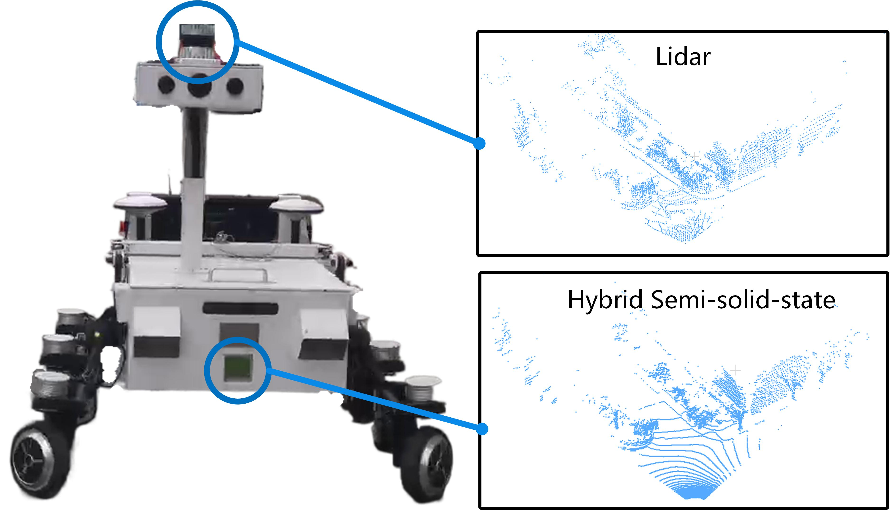
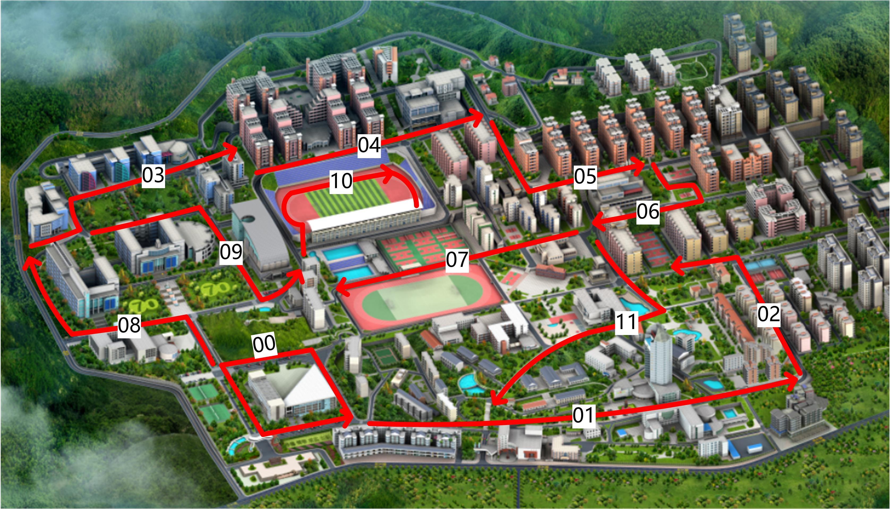
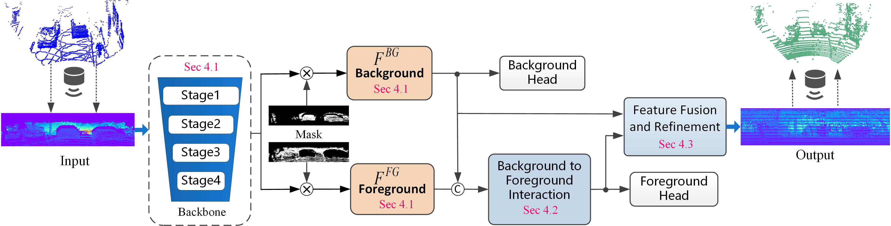

# TransLiDAR: A dataset and benchmark for Cross-Sensor Point Cloud Translation
This is an official implementation of the paper **TransLiDAR: A dataset and benchmark for Cross-Sensor Point Cloud Translation**.
## Installation
Our work is implemented with the following environmental setups:
* Python == 3.8
* PyTorch == 1.12.0
* CUDA == 11.3

You can use conda to create the correct environment:
```
conda create -n myenv python=3.8
conda install pytorch==1.12.0 torchvision==0.13.0 torchaudio==0.12.0 cudatoolkit=11.3 -c pytorch
```

Then, install the dependencies in the environment:
```
pip install -r requirements.txt
pip install git+'https://github.com/otaheri/chamfer_distance'  # need access to gpu for compilation
```
You can refer to more details about chamfer distance package from https://github.com/otaheri/chamfer_distance

## TransLiDAR Dataset 
The TransLiDAR dataset is collected using an autonomous vehicle platform equipped with two types of LiDAR sensors: an Ouster 64-line mechanical LiDAR mounted on the roof and a Livox hybrid solid-state LiDAR mounted at the front of the vehicle, as shown in Fig. 1. Data collection takes place on a university campus, where 12 routes are designed to comprehensively cover the entire area, as illustrated in Fig. 2. In total, the dataset contains 15,641 pairs of point cloud data. Each pair includes a frame of synchronized point clouds from both the mechanical LiDAR and the hybrid solid-state LiDAR. Detailed information is provided in Table 1.

- **Dataset directory structure** 


- **Georegistered poses overlaid on School Map** 


**Table 1: Dataset Statistics**

| Sequence | Frames (LiDAR) | Frames (Area Array) | Data Volume |
|----------|----------------|---------------------|-------------|
| 00       | 3047           | 3047                | 1.21 GB     |
| 01       | 1530           | 1530                | 0.55 GB     |
| 02       | 63             | 63                  | 0.08 GB     |
| 03       | 1572           | 1572                | 0.57 GB     |
| 04       | 600            | 600                 | 0.22 GB     |
| 05       | 600            | 600                 | 0.21 GB     |
| 06       | 544            | 544                 | 0.21 GB     |
| 07       | 770            | 770                 | 0.29 GB     |
| 08       | 3200           | 3200                | 1.17 GB     |
| 09       | 35             | 35                  | 0.01 GB     |
| 10       | 910            | 910                 | 1.15 GB     |
| 11       | 2770           | 2770                | 1.02 GB     |


You can download the dataset via Baidu Netdisk using the following link: https://pan.baidu.com/s/1wX8j819NX-fGRABLRTuPPA?pwd=z14b **Extraction code: z14b** 
The transLiDA dataset should be structured in this way:
```
TransLiDAR
│
├── sequences                          # The data includes 12 routes.
│   │
│   ├── 00                              # The data of the first route.
│   │   ├── lidar                       # The data of the rotating mechanical LiDAR.
│   │   │   ├── 000000.bin
│   │   │   ├── 000001.bin
│   │   │   └── ...
│   │   ├── hybrid                      # The data of the Hybrid semi-solid-state LiDAR.
│   │   │   ├── 000000.bin
│   │   │   ├── 000001.bin
│   │   │   └── ...
│   │   ├── image                       # Image data captured by the camera.
│   │   │   ├── 000000.jpg
│   │   │   ├── 000002.jpg
│   │   │   └── ...
│   │   └── Calib.txt                   # The intrinsic and extrinsic matrices between the hybrid and the mechanical LiDAR.
│   │
│   ├── 01                              # The data of the second route.
│   ├── ...                             # Additional routes (02 to 10)
│   └── 11                              # The data of the last route.
```

After downloading the raw dataset, create train and test split for LiDAR upsampling:

```
bash bash_scripts/transLiDAR_translation.sh

```

The new dataset should be structured in this way:

```
dataset
│
└─── TransLiDAR
   │
   └───train
   │   │   00000001.npy
   │   │   00000002.npy
   │   │   ...
   └───val
       │   00000001.npy
       │   00000002.npy
       │   ...
```

## TransLiDAR-Net
 we conduct a preliminary exploration of cross-sensor point cloud translation method based on the TransLiDAR dataset. To this end, we propose a network called TransLiDAR-Net, which is designed to translate point clouds captured by hybrid solid-state LiDAR into the style of mechanical LiDAR. As illustrated in Fig. 3, TransLiDAR-Net comprises several key components: a carefully designed dual-branch backbone network, a foreground-background feature interaction module, a foreground prediction head, a background prediction head, and an output head for final result fusion.  The following introduces the input and output of the network, followed by a detailed description of each individual module.

- **The overview of our TransLiDAR-Net framework** 


## Training
We provide some bash files for running the experiment quickly with default settings. 
```
bash bash_scripts/transLiDAR_translation.sh
```

## Evaluation
After the model training is completed, you can find the saved model weights under the `experiment/` directory. By default, the model weights are saved every 100 epochs. Then, run the evaluation code below:
```
bash bash_scripts/transLiDAR_evaluation.sh
```

## Citation
```

```

